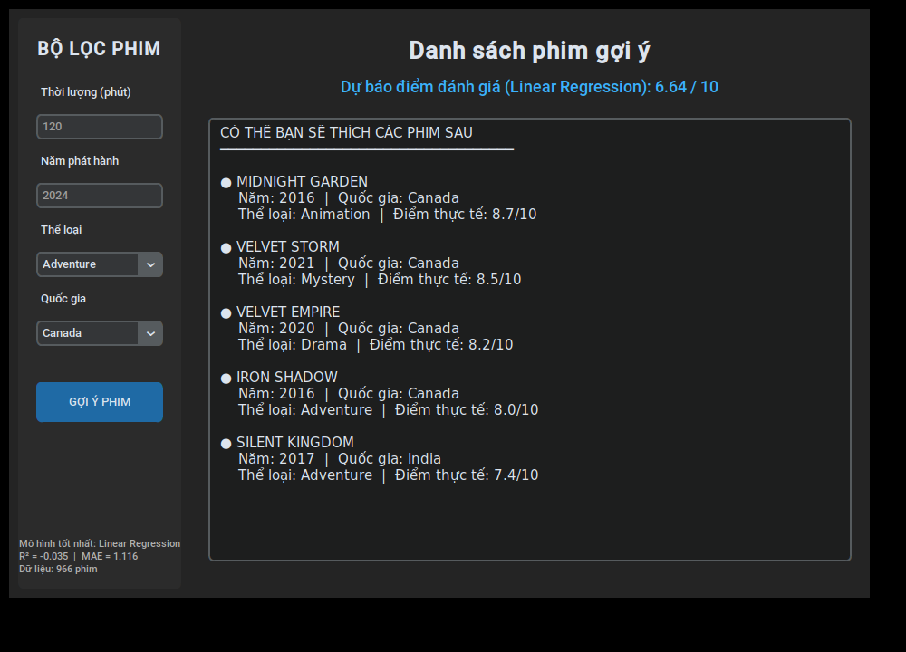

# 🎬 AI Movie Recommender

Ứng dụng desktop **dự đoán điểm đánh giá của phim** và **gợi ý những bộ phim tương tự, được đánh giá cao** dựa trên các đặc điểm đơn giản (thời lượng, năm phát hành, thể loại, quốc gia). Ứng dụng huấn luyện và so sánh nhiều mô hình hồi quy — **Linear Regression**, **Random Forest** và **Gradient Boosting** — rồi tự động chọn mô hình tốt nhất. Được xây dựng bằng **scikit-learn** và giao diện **CustomTkinter**.


---

## ✨ Tính năng

- **So sánh mô hình** — huấn luyện Linear Regression (mô hình nền để so sánh), Random Forest và Gradient Boosting, đánh giá từng mô hình trên tập kiểm tra (R², MAE, RMSE) rồi tự động chọn mô hình tốt nhất.
- **Dự đoán điểm** — ước lượng điểm TMDB kỳ vọng của phim (thang 1–10).
- **Gợi ý thông minh** — tìm các phim giống nhất bằng **cosine similarity**, sau đó sắp xếp lại theo điểm đánh giá thực tế để gợi ý vừa liên quan vừa chất lượng.
- **Chạy được ngay** — có sẵn script sinh dữ liệu mẫu để dùng thử mà không cần tải bộ dữ liệu đầy đủ.
- **Có kiểm thử** — bộ test `pytest` cùng GitHub Actions CI giúp đảm bảo pipeline luôn hoạt động.

---

## 🖼️ Ảnh demo

> _Thêm ảnh chụp ứng dụng vào `docs/screenshot.png`, ảnh sẽ tự hiển thị ở đây._

  

---

## 🧠 Cách hoạt động

1. **Chuẩn bị dữ liệu** — nạp bộ dữ liệu TMDB, giữ lại các phim có hơn 500 lượt bình chọn, lấy thể loại và quốc gia *chính*, trích xuất năm phát hành, và mã hóa one-hot cho các cột phân loại.
2. **Huấn luyện & so sánh mô hình** — đặc trưng được chuẩn hóa bằng `MinMaxScaler` (chỉ fit trên tập huấn luyện để tránh rò rỉ dữ liệu). Nhiều mô hình được huấn luyện và chấm điểm trên tập kiểm tra; mô hình có R² cao nhất được chọn để dự đoán `vote_average`.
3. **Gợi ý** — các đặc điểm đã chọn được biến thành cùng một vector đặc trưng và so khớp với mọi phim bằng cosine similarity. Một danh sách rút gọn các phim gần nhất sau đó được sắp xếp theo điểm để tạo ra 5 gợi ý cuối cùng.

---

## 📁 Cấu trúc dự án

```
ai-movie-recommender/
├── main.py                     # Điểm chạy: nạp dữ liệu, so sánh mô hình, mở GUI
├── conftest.py                 # Giúp import được project khi chạy test
├── requirements.txt            # Thư viện chạy ứng dụng
├── requirements-dev.txt        # Thư viện cho kiểm thử
├── README.md  ·  LICENSE  ·  .gitignore
├── .github/workflows/ci.yml    # CI của GitHub Actions
├── data/                       # Đặt bộ dữ liệu vào đây (bị .gitignore bỏ qua)
├── scripts/
│   └── generate_sample_data.py # Sinh bộ dữ liệu mẫu nhỏ
├── tests/
│   └── test_pipeline.py        # Kiểm thử (không cần GUI)
└── movie_recommender/
    ├── config.py               # Toàn bộ hằng số và đường dẫn có thể chỉnh
    ├── data.py                 # Nạp, làm sạch, mã hóa đặc trưng
    ├── model.py                # Huấn luyện, so sánh, gợi ý
    └── gui.py                  # Giao diện CustomTkinter
```

---

## 🚀 Bắt đầu

### Yêu cầu

- Python 3.10 trở lên

### 1. Tải về và cài đặt

```bash
git clone https://github.com/qockhah253/ai-movie-recommender.git
cd ai-movie-recommender

# (khuyến nghị) tạo môi trường ảo
python -m venv .venv
.venv\Scripts\activate        # Windows
# source .venv/bin/activate   # macOS / Linux

pip install -r requirements.txt
```

### 2a. Chạy nhanh — dùng thử với dữ liệu mẫu (không cần tải)

```bash
python scripts/generate_sample_data.py   # tạo file dữ liệu giả trong data/
python main.py
```

> Dữ liệu mẫu là **dữ liệu giả** (tên phim và điểm số ngẫu nhiên), chỉ để dùng thử ứng dụng.

### 2b. Chạy với bộ dữ liệu thật

Tải **bộ dữ liệu TMDB Movies** từ Kaggle — [asaniczka/tmdb-movies-dataset-2023-930k-movies](https://www.kaggle.com/datasets/asaniczka/tmdb-movies-dataset-2023-930k-movies) — và đặt file `TMDB_movie_dataset_v11.csv` vào thư mục `data/` ở thư mục gốc của dự án:

```
data/TMDB_movie_dataset_v11.csv
```

Sau đó chạy:

```bash
python main.py
```

Khi khởi động, console sẽ in ra bảng so sánh mô hình, ví dụ:

```
Model comparison (held-out test set):
            model    r2   mae  rmse
Gradient Boosting 0.18x 0.6xx 0.8xx
    Random Forest 0.15x 0.6xx 0.8xx
Linear Regression 0.09x 0.7xx 0.9xx

Best model: Gradient Boosting
```

*(Con số cụ thể phụ thuộc vào dữ liệu; điểm phim vốn khó dự đoán chính xác từ các đặc trưng này, nên giá trị ở mức khiêm tốn là điều bình thường.)*

---

## 🧪 Chạy kiểm thử

```bash
pip install -r requirements-dev.txt
python scripts/generate_sample_data.py   # test cũng tự sinh dữ liệu riêng
pytest
```

---

## ⚙️ Tùy chỉnh

Mọi giá trị có thể chỉnh đều nằm trong `movie_recommender/config.py` — số lượt bình chọn tối thiểu, số thể loại/quốc gia giữ lại, tỉ lệ chia tập train/test, số lượng gợi ý, và đường dẫn dữ liệu. Chỉnh ở đó mà không cần đụng tới phần còn lại của code.

---

## ⚠️ Lưu ý & Hạn chế

- Điểm đánh giá của phim chỉ tuyến tính yếu với các đặc điểm như thời lượng hay thể loại, nên R² ở mức khiêm tốn là cố ý — dự án này là một ví dụ rõ ràng, đầu-cuối về hồi quy + độ tương đồng, chứ không phải một hệ gợi ý hàng đầu.
- Chỉ dùng thể loại và quốc gia *chính* để giữ không gian đặc trưng nhỏ gọn.
- Gợi ý dựa trên nội dung (độ tương đồng đặc điểm), không phải collaborative — không có lịch sử theo từng người dùng.

---

## 🛣️ Hướng phát triển

- Dùng tất cả thể loại bằng mã hóa multi-hot thay vì chỉ thể loại đầu tiên.
- Thêm độ tương đồng ngữ nghĩa dựa trên phần mô tả phim (ví dụ embedding Sentence-BERT).
- Chuyển sang bộ dữ liệu có tương tác người dùng (ví dụ MovieLens) để làm collaborative filtering.
- Lưu cache mô hình đã huấn luyện để ứng dụng khởi động tức thì.

---

## 📝 Giấy phép

Phát hành theo [Giấy phép MIT](LICENSE).
